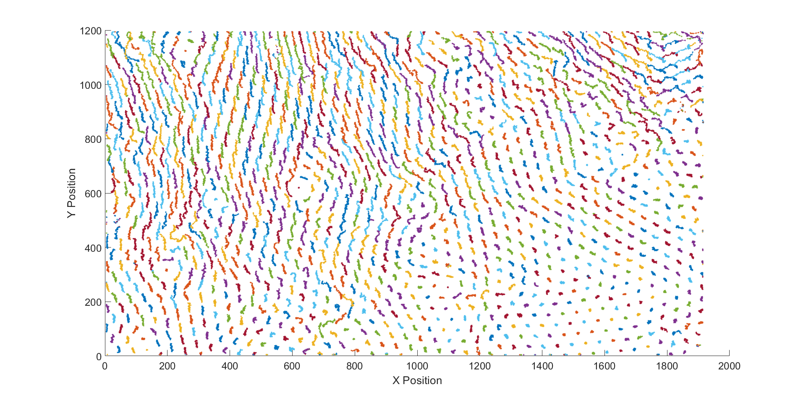
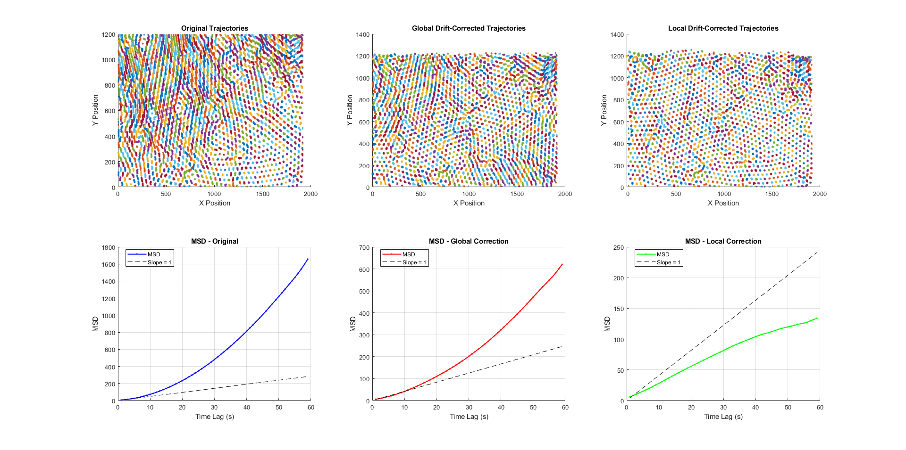

# Colloidal Particles Dynamics

Analysis of the dynamics of colloidal particles under a uniform vertical magnetic field.  
This project was carried out during my Master's research internship at **LCP-A2MC (2025)**.  
The focus was on studying the **Mean Squared Displacement (MSD)**, trajectory corrections,  
and the phenomenon of **caging** in ferromagnetic colloids.

---

## Objectives
- Implement MSD analysis for multiple particle trajectories
- Apply **global** and **local drift corrections**
- Compare corrected vs. raw MSD results
- Investigate the emergence of the **caging effect**

---

## Repository structure
- `codes/` → MATLAB scripts (with a dedicated README)
- `figures/` → plots and key visual results
- `macros/` → .ijim files (to use in ImageJ)
- `docs/` → final internship report & oral presentation slides

---

## Example Results
**Trajectory visualization**  


**MSD with drift correction**  


---

## ▶️ How to run

### MATLAB
Open `src/analysis_MSD.m` and run:
```matlab
run('src/analysis_MSD.m')
